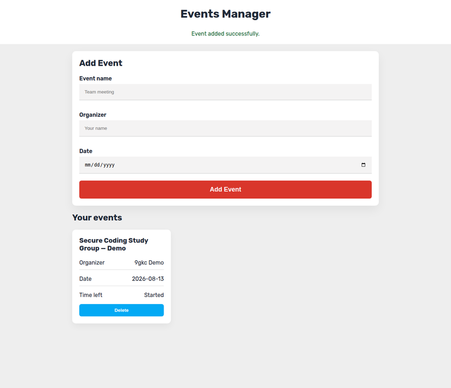

# 📅 Events Manager Pro

> **Live demo:** [Open Eventify in your browser](https://9gkc.github.io/Eventify/)

  
  
  

Stay organized and never miss a deadline. This application provides a robust system for tracking upcoming events with precise, real-time countdown timers.

## Interface preview

  

> The preview shows an explicitly labelled demonstration entry. Eventify stores entries in the current browser's LocalStorage only; it does not create calendar bookings, accounts, attendees, or server-side event records.

## 🚀 Key Features
- **Persistent Data**: Uses Browser LocalStorage to keep your events saved across sessions.
- **Live Countdowns**: Real-time updates for days, hours, minutes, and seconds remaining.
- **Validation**: Built-in logic to prevent scheduling events in the past and limit invalid input.
- **Easy Management**: Add and delete events instantly with a clean dashboard view.
- **Safe Rendering**: Event values are rendered with DOM APIs rather than HTML interpolation.
- **Accessible UX**: Labeled fields, keyboard-friendly forms, and live status updates.

## 🛠️ Installation & Usage
1. Clone the repository: `git clone https://github.com/9gkc/Eventify.git`
2. Serve or open `index.html` to start tracking events. Data remains in the current browser's LocalStorage.
3. Existing data saved under the earlier `events` key is read automatically and retained when new changes are saved. No server or account is required.

---
